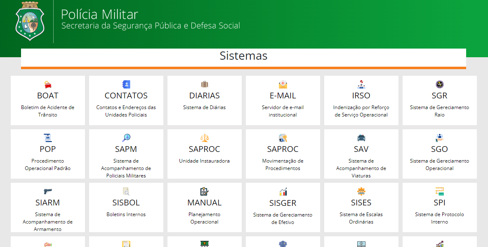

Clone do Site de Sistemas da PMCE


## Índice

- [Visão geral](#visãogeral)
  - [O desafio](#the-challenge)
  - [Captura de tela](#capturadetela)
- [Meu processo](#meu-processo)
  - [Construído com](#construídocom)
  - [O que aprendi](#o-que-aprendi)
- [Autor](#autor)

## Visão geral

### O desafio

Os usuários devem ser capazes de:

- Visualizar o layout ideal para o aplicativo, dependendo do tamanho da tela do dispositivo

### Captura de tela




## Meu processo

### Construído com

- Marcação HTML5
- Propriedades personalizadas de CSS
- SASS
- Flexbox
- Grid

### O que eu aprendi

- Responsividade
- Uso do SASS

``` css
#card {
  position: relative;
  margin: 5px 5px;
  width: 180px;
  height: 120px;
  border-radius: 0px;
  border: 5px solid transparent;

  // :hover aninhado ao #card
  &:hover {
    border-left: 10px solid #00621d;
  }
}
```

## Autor

- Linkendin - [Michell Melo](https://www.linkedin.com/in/michell-melo-23a6301a8)